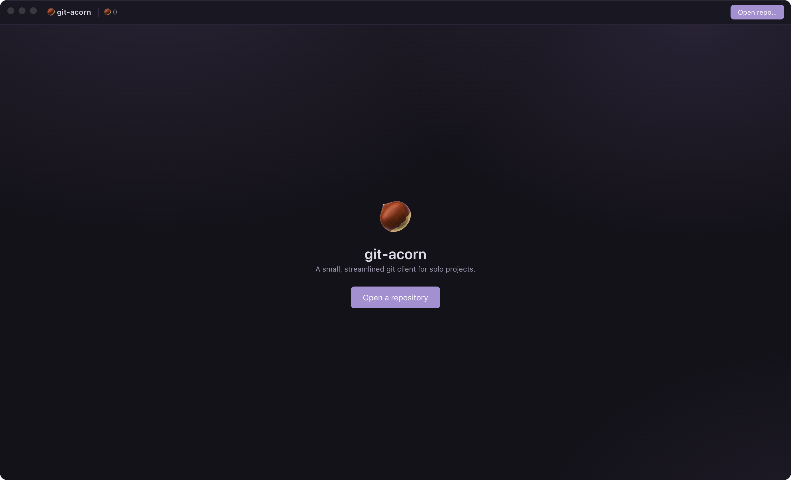

<div align="center">

# 🌰 git-acorn

### A calm, always-graphed git client for solo developers.

A lighter alternative to GitHub Desktop with the quality-of-life of VS Code's
source control — and a **commit graph that's always on screen**.

<p>
  
  
  
  
</p>



</div>

---

## Why git-acorn?

Simple: Some applications don't provide easy extensions to use git. The go-to for those is either the terminal (which requires VIM-level patience) or Github desktop. 
git-acorn is designed for **one person and their repo**: the commit graph is always visible, the common actions are one click away, and it stays out of your way. 
It shells out to your local `git` — nothing leaves your machine.

And if you ever need any more advanced features, you can easily open a terminal in the application itself.

## Features

- **Always-on commit graph** — Git Graph–style lanes with branch / tag / HEAD
  chips, right there next to your changes. Click any commit for its author,
  message, and changed files.
- **Commit Wizard** - Easily overview each change in the current commit (perfect if you ocasionally forget to commit), open PRs, create branches.
- **Changes view** like VS Code / GitHub Desktop — stage, unstage, and discard
  per-file or all at once, with inline and side-by-side diffs.
- **Branches & commits from the graph** — right-click to check out, create,
  rename, merge, or delete a branch; check out any commit or **spin a new branch
  off it**.
- **Pull requests** — see open PRs inline and check mergeability without leaving
  the app (via the `gh` CLI when available).
- **One-click Sync** — pull-then-push with ahead/behind counts.
- **Built-in terminal** for when you want to drop to raw git — works on macOS,
  Windows, and Linux.
- **Open files anywhere** — right-click a changed file to open it in your editor,
  the default app, or reveal it in Finder / Explorer.
- **Auto-updates** — new releases announce themselves and install on restart.
- **A little friend** — keep an eye out for the critter that skitters across your
  graph. Click it to shake loose the acorns it's been hoarding. 🐿️

## Install

Grab the latest build for your platform from the
[**Releases**](https://github.com/alexeckardt/git-leaf/releases) page:

| Platform | File |
| --- | --- |
| macOS | `Git-Leaf-<version>-arm64.dmg` |
| Windows | `Git-Leaf-Setup-<version>.exe` |
| Linux | `Git-Leaf-<version>.AppImage` |

> [!NOTE]
> The app isn't code-signed yet, so the first launch shows a warning.
> On macOS: right-click the app → **Open**. On Windows: **More info → Run anyway**.

Once installed, git-acorn keeps itself up to date — when a newer release is
published it shows a banner and updates on the next restart. (macOS auto-update
activates once the app is code-signed; Windows and Linux update out of the box.)

## Build from source

```bash
npm install
npm run dev        # launch with hot reload
npm run typecheck  # tsc across main + preload + renderer
npm run package    # build an installer for the current OS into dist/
```

Electron apps build per-OS: run `npm run package` on macOS for the `.dmg` and on
Windows for the `.exe`.

## Architecture

| Layer | Location | Role |
| --- | --- | --- |
| Main | `src/main/git.ts` | Runs `git` via `child_process` and parses its output (`status --porcelain=v2 -z`, `log --topo-order`, `show --numstat`, …) |
| Main | `src/main/index.ts` | Window lifecycle, native menu, and IPC handlers |
| Main | `src/main/updater.ts` | Auto-update against GitHub Releases (`electron-updater`) |
| Main | `src/main/terminal.ts` | The built-in terminal (PowerShell on Windows, POSIX shells elsewhere) |
| Preload | `src/preload/index.ts` | `contextBridge` exposing typed `window.gitApi` / `windowApi` / `updateApi` |
| Renderer | `src/renderer/src/` | React UI (graph layout in `lib/graph.ts`) |
| Shared | `src/shared/types.ts` | Types used across all three processes |

## Releasing

Cutting a release publishes installers to GitHub and triggers auto-update for
everyone running the app. See [**RELEASING.md**](RELEASING.md).
